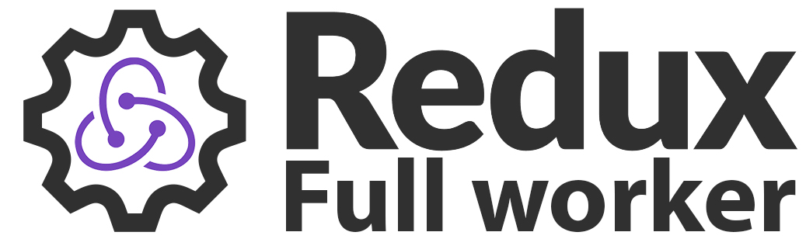

# Coffeekraken redux-full-worker 

<p>
	<!-- <a href="https://travis-ci.org/coffeekraken/redux-full-worker">
		
	</a> -->
	<a href="https://www.npmjs.com/package/coffeekraken-reduxfullb-worker">
		
	</a>
	<a href="https://github.com/coffeekraken/redux-full-worker/blob/master/LICENSE.txt">
		
	</a>
	<!-- <a href="https://github.com/coffeekraken/redux-full-worker">
		
	</a>
	<a href="https://github.com/coffeekraken/redux-full-worker">
		
	</a>
	<a href="https://github.com/coffeekraken/redux-full-worker">
		
	</a> -->
	<a href="https://twitter.com/coffeekrakenio">
		
	</a>
	<a href="http://coffeekraken.io">
		
	</a>
</p>

Redux "container" that let you run all your redux code (reducers, thunk, sagas, actions, etc...) inside a web worker that communicate with the main app thread and update the main store accordingly.

## Table of content

1. [Install](#readme-install)
2. [Get Started](#readme-get-started)
3. [Requirements](#readme-requirements)
4. [Browsers support](#readme-browsers-support)
5. [Contribute](#readme-contribute)
6. [Who are Coffeekraken?](#readme-who-are-coffeekraken)
7. [Licence](#readme-license)

<a id="readme-install"></a>
## Install

```
npm install coffeekraken-redux-full-worker --save
```

<a id="readme-get-started"></a>
## Get Started

Let's check first our `app.js` file that bootstrap our application

```js
import ReactDOM from 'react-dom'
import { Provider } from 'react-redux'
import ReduxWorker from './redux.worker'
import { applyMiddleware } from 'redux'
import { createStore } from 'coffeekraken-redux-full-worker'

// some reducers if needed in the main thread
// but all the main reducers will live in the worker.
// !! don't combine the reducers here cause it will be done
// by the createStore function
const reducers = {
  // key: reducerFn
}

// create our store
const store = createStore(ReduxWorker, reducers, {
	// initial state. Important cause we don't have all the reducers
	// to initialise our state
	// key: stateObj
}, applyMiddleware(...))

// render our app with our store
ReactDOM.render(
  <Provider store={store}>
    // etc...
  </Provider>,
  document.querySelector('#root')
)
```

Next we have our `redux.worker.js` file that is the main of all our workerized code. Here's how it looks:

```js
import { createStore, applyMiddleware, combineReducers } from 'redux'
import { expose } from 'coffeekraken-redux-full-worker'
import reducers from '...' // your application reducers

// create the actual store of our app with middlewares, etc...
const store = createStore(
	combineReducers(reducers),
	{},
	applyMiddleware(...)
)

// expose your store to the main app
expose(store, self)
```

<a id="readme-requirements"></a>
## Requirements

In order for this middleware to work, you'll need to install the [worker-loader](https://github.com/webpack-contrib/worker-loader) webpack loader.

```
npm install worker-loader --save-dev
```

Here's an example of webpack configuration:

#### `webpack.config.js`
```js
module.exports = {
  //...
  module: {
    rules: [{
      test: /\.worker\.js$/,
      use: {
        loader: 'worker-loader',
        options: {
          inline: true,
          fallback: false
        }
      }
    }]
  }
}
```

<a id="readme-browsers-support"></a>
## Browsers support

| </br>IE / Edge | </br>Firefox | </br>Chrome | </br>Safari |
| --------- | --------- | --------- | --------- |
| IE11+ | last 2 versions| last 2 versions| last 2 versions

> As browsers are automatically updated, we will keep as reference the last two versions of each but this component can work on older ones as well.

<a id="readme-contribute"></a>
## Contribute

This is an open source project and will ever be! You are more that welcomed to contribute to his development and make it more awesome every day.
To do so, you have several possibilities:

1. [Share the love ❤️](https://github.com/Coffeekraken/coffeekraken/blob/master/contribute.md#contribute-share-the-love)
2. [Declare issues](https://github.com/Coffeekraken/coffeekraken/blob/master/contribute.md#contribute-declare-issues)
3. [Fix issues](https://github.com/Coffeekraken/coffeekraken/blob/master/contribute.md#contribute-fix-issues)
4. [Add features](https://github.com/Coffeekraken/coffeekraken/blob/master/contribute.md#contribute-add-features)
5. [Build web component](https://github.com/Coffeekraken/coffeekraken/blob/master/contribute.md#contribute-build-web-component)

<a id="readme-who-are-coffeekraken"></a>
## Who are Coffeekraken

We try to be **some cool guys** that build **some cool tools** to make our (and yours hopefully) **every day life better**.  

#### [More on who we are](https://github.com/Coffeekraken/coffeekraken/blob/master/who-are-we.md)

<a id="readme-license"></a>
## License

The code is available under the [MIT license](LICENSE.txt). This mean that you can use, modify, or do whatever you want with it. This mean also that it is shipped to you for free, so don't be a hater and if you find some issues, etc... feel free to [contribute](https://github.com/Coffeekraken/coffeekraken/blob/master/contribute.md) instead of sharing your frustrations on social networks like an asshole...
